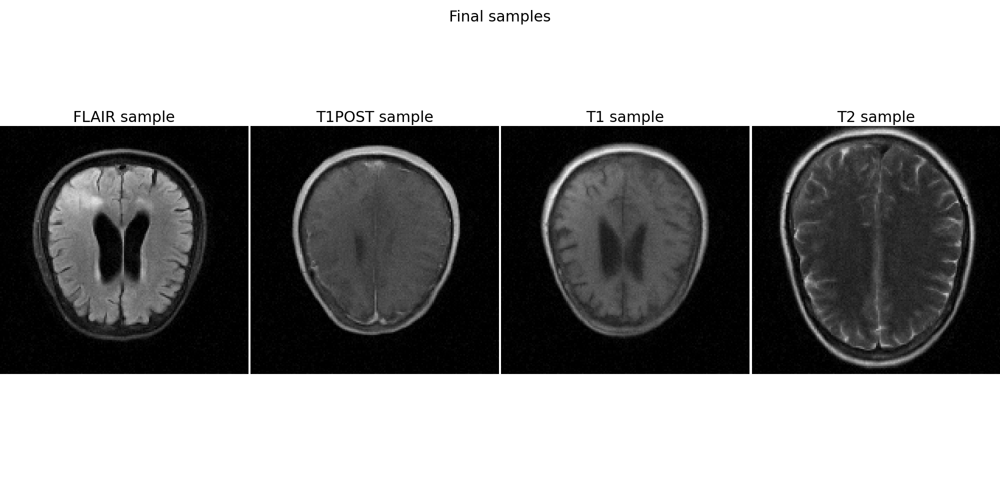

# DDPM Fastmri Brain

Based on code for my ECE:5995 Applied Machine Learning project. Implements a denoising diffusion probabilistic model (DDPM) to generate brain MR images. This code is based on the [Conditional Diffusion MNIST](https://github.com/TeaPearce/Conditional_Diffusion_MNIST) repository on GitHub, which in turn implements the algorithms from ["Denoising Diffusion Probabilistic Models" by Ho et al](https://arxiv.org/abs/2006.11239).

### Training

See `mri_conditional_train.ipynb` for training code. The DDPM is trained on FastMRI brain data, which consists of 4 contrasts: FLAIR, T1POST, T1, and T2.

### Sampling

See `mri_conditional_test.ipynb` for sampling code. A trained DDPM model is loaded from a checkpoint, then used to generate new images. Also able to generate GIF animation showing the diffusion process.

### Mean and variance images

See `mri_conditional_test_var.ipynb` for code to sample multiple times and compute mean and pixel-wise variance. This can help us visualize the distribution of samples and how variable they are.